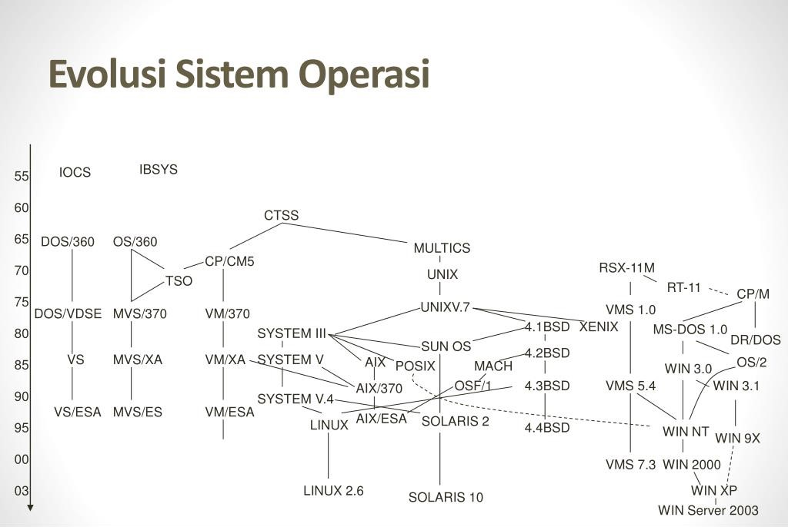
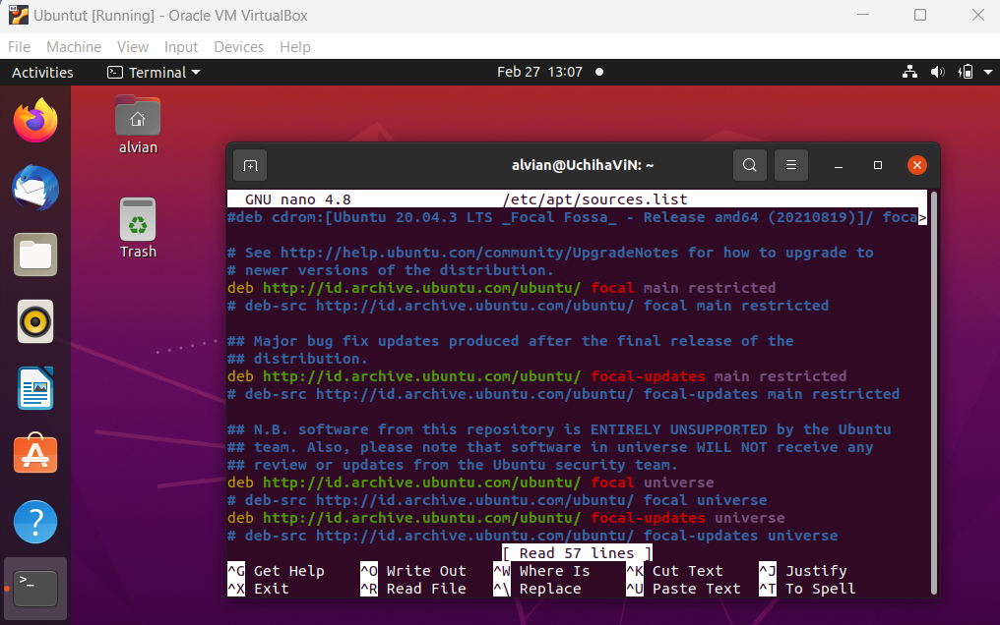

## *Laporan Praktikum Workshop Administasi Jaringan*
# *Package Management*
### Dosen Pengampu : Dr. Ferry Astika Saputra ST, M.Sc

### Nama : Aradhea Rangga Maulana

### NRP : 3121600057

  
 
  
Sistem operasi telah mengalami banyak evolusi sejak pertama kali diciptakan. Beberapa tahapan penting dalam evolusi sistem operasi:
1.	Sistem Operasi Batch Processing (1950-an): Pada awalnya, sistem operasi digunakan untuk memproses tugas secara batch, di mana banyak tugas dikumpulkan dalam satu file dan diproses secara otomatis.
2.	Sistem Operasi Time-Sharing (1960-an): Sistem operasi time-sharing memungkinkan beberapa pengguna untuk menggunakan komputer secara bersamaan. Pengguna dapat mengakses terminal yang terhubung ke komputer dan menggunakan aplikasi secara interaktif.
3.	Sistem Operasi Multi-Programming (1960-an dan 1970-an): Sistem operasi multi-programming memungkinkan beberapa program untuk berjalan secara bersamaan dalam memori komputer. Hal ini memungkinkan pengguna untuk menjalankan lebih banyak program dalam waktu yang sama.
4.	Sistem Operasi Personal Computer (1980-an dan 1990-an): Dengan kemunculan komputer pribadi, sistem operasi seperti MS-DOS dan Windows menjadi sangat populer. Sistem operasi ini dirancang untuk digunakan oleh satu pengguna pada satu komputer.
5.	Sistem Operasi Berbasis Jaringan (1990-an dan 2000-an): Sistem operasi berbasis jaringan seperti Windows NT dan Linux memungkinkan beberapa pengguna untuk terhubung ke jaringan dan berbagi sumber daya, seperti file dan printer.
6.	Sistem Operasi Mobile (2000-an dan 2010-an): Dengan kemunculan telepon pintar, sistem operasi mobile seperti Android dan iOS menjadi sangat populer. Sistem operasi ini dirancang untuk digunakan pada perangkat mobile dengan layar kecil dan sumber daya terbatas.
7.	Sistem Operasi Cloud (2010-an dan seterusnya): Sistem operasi cloud seperti Amazon Web Services (AWS) dan Microsoft Azure memungkinkan pengguna untuk menggunakan komputasi awan untuk menyimpan dan memproses data. Sistem operasi ini dirancang untuk berjalan di pusat data dan menyediakan sumber daya komputasi yang fleksibel dan mudah diakses.
Secara keseluruhan, evolusi sistem operasi mencerminkan kemajuan teknologi dan perubahan kebutuhan pengguna. Dari batch processing hingga cloud computing, sistem operasi terus berkembang untuk memenuhi kebutuhan pengguna yang semakin kompleks.
<h3>Pengertian SU (Super User) </h3>

\
SU (superuser) adalah mode pengguna di sistem operasi Linux yang memungkinkan pengguna untuk menjalankan perintah dengan hak akses root atau administrator. Dalam Ubuntu, su biasanya dinonaktifkan secara default, dan diganti dengan menggunakan perintah "sudo".
Sudo memungkinkan pengguna yang telah diberi izin untuk menjalankan perintah dengan hak akses root sementara. Untuk menggunakan sudo, pengguna harus mengetikkan "sudo" diikuti dengan perintah yang ingin dijalankan. Sistem akan meminta pengguna untuk memasukkan kata sandi mereka terlebih dahulu untuk memastikan bahwa mereka memiliki izin untuk menjalankan perintah.

<h3>Pengertian Sudo (Super User Do)</h3>
Sudo (superuser do) adalah sebuah perintah di sistem operasi Ubuntu (dan juga distro Linux lainnya) yang digunakan untuk memberikan hak akses superuser atau administrator ke pengguna biasa, sehingga pengguna tersebut dapat menjalankan perintah yang memerlukan hak akses superuser atau administrator. Dalam Ubuntu, perintah sudo biasanya digunakan dengan format "sudo [command]" di terminal.

<h3>Package Maintenance</h3>

1.	Buka terminal melalui menu di ubuntu
2.	Ketikan perintah "sudo nano /etc/apt/sources.list" dan tekan Enter. Anda akan diminta untuk memasukkan password pengguna dengan hak akses superuser atau administrator.
3.	Setelah itu, Anda akan melihat file "sources.list" yang berisi daftar repositori Ubuntu. Untuk menambahkan repositori baru, tambahkan baris baru pada akhir file dengan format "deb [URL] [distro] [component]".
4.	Ganti [URL] dengan URL repositori baru yang ingin ditambahkan, [distro] dengan nama versi Ubuntu yang sedang digunakan (misalnya, focal, bionic, xenial), dan [component] dengan komponen dari repositori tersebut (misalnya, main, universe, restricted, multiverse).
5.	Setelah menambahkan repositori baru, tekan Ctrl+X untuk keluar dari editor Nano, dan pilih Y untuk menyimpan perubahan yang telah dilakukan.
6.	Terakhir, jalankan perintah "sudo apt-get update" untuk memperbarui daftar paket dari repositori baru yang telah ditambahkan.
Setelah proses ini selesai, repositori baru telah ditambahkan pada sistem Ubuntu Anda dan dapat digunakan untuk menginstal paket baru.

<h3>Contoh Instalasi Paket</h3>

<h4>Instalasi HTOP</h4>

HTOP adalah sebuah perangkat lunak monitoring sistem yang tersedia di sistem operasi Ubuntu.HTOP menyediakan tampilan yang lebih interaktif dan memudahkan pengguna untuk memantau kinerja sistem.

<h4>Instalasi MC</h4>

MC (Midnight Commander) adalah sebuah file manager yang tersedia di sistem operasi Ubuntu. MC menyediakan antarmuka baris perintah yang intuitif dan memudahkan pengguna untuk menjelajahi direktori, mengedit file teks, melakukan operasi copy dan paste, serta mengarsipkan file.