<h2>
Praktikum Minggu 4 ||
Aradhea Rangga Maulana (3121600057)
</h2>

Mengecek apakah komputer sudah mendapatkan IP menggunakan perintah dibawah ini
> ip a

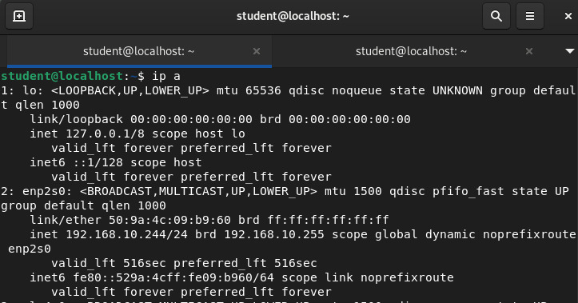

Apabila pc telah mendapatkan ip, selanjutnya adalah melakukan pengecekan terhadap ip laptop / interface lainnya.

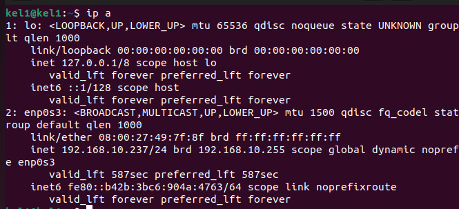

IP laptop disini harus dipastikan sesuai dengan mikrotik yang sudah disetting sebelumnya. yaitu menggunakan 192.168.x.x, disini ip yang digunakan oleh pc dan komputer adalah 192.168.10.x karena berada di kelompok 10.

Sebelum melanjutkan praktikum, pastikan jaringan sudah mengenali semua jaringan yang berada di lab, apabila belum kita harus melakukan new route pada winbox seperti gambar dibawah ini

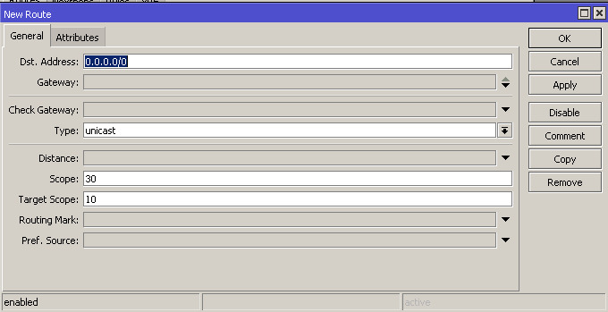
.jpg)

Isikan dst address dan gateway sesuai dengan jaringan yang ada di lab. Apabila sudah selesai melakukan routing, maka tampilan akan seperti ini

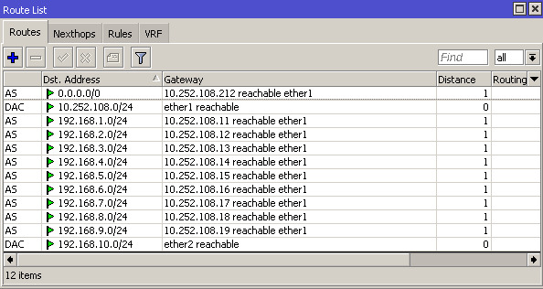

Setelah routing ke semua jaringan yang ada di lab selesai, maka selanjutnya adalah menjalankan Virtual Machine dan memastikan setting jaringan VM nya berupa Bridge dan pastikan mendapatkan ip via dhcp dengan benar

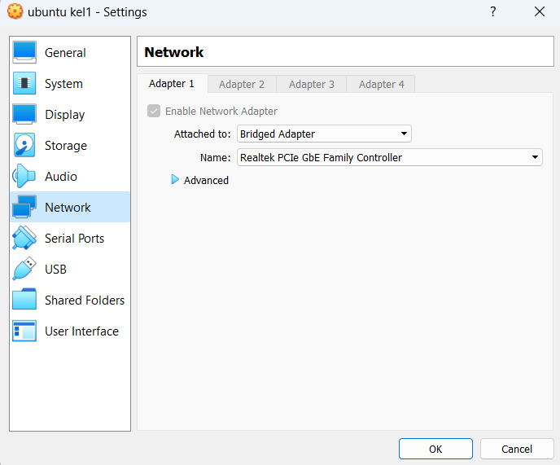

Setelah itu, melakukan setting ip vm menjadi static (192.168.10.10)

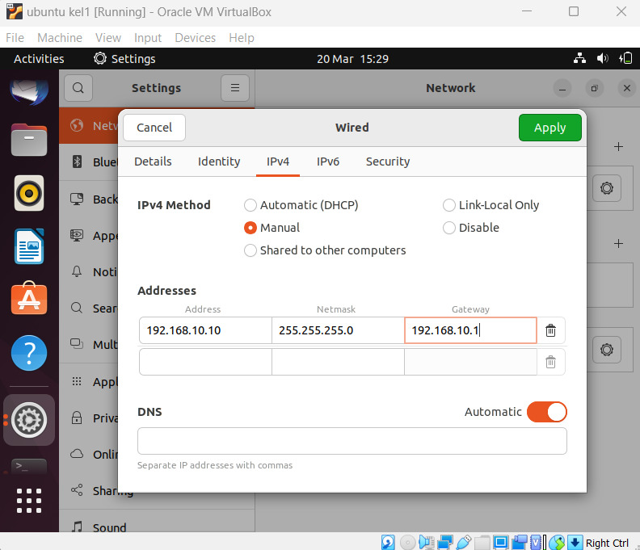
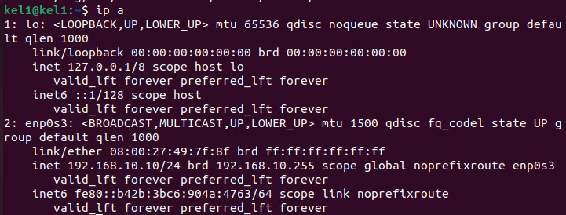

Praktikum selanjutnya adalah melakukan konfigurasi NTP menjadi 0.id.pool.ntp.org

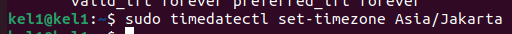
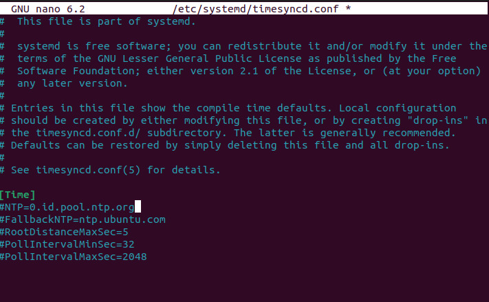
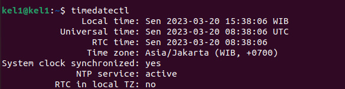
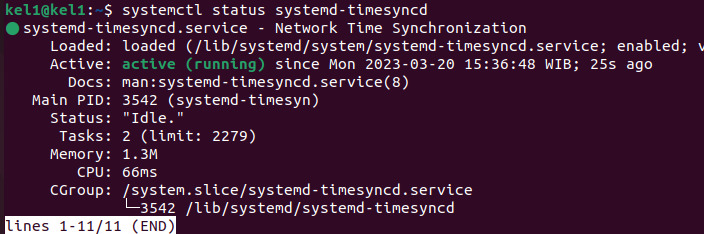

Setelah melakukan konfigurasi NTP kita melakukan penggantian hostname Virtual Machine menjadi server10.kelompok10.takehome.com menggunakan perintah
> sudo nano /etc/hostname

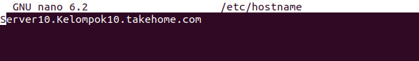
