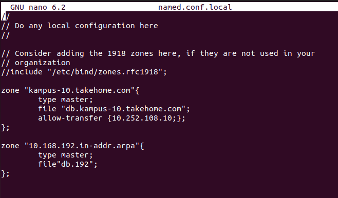
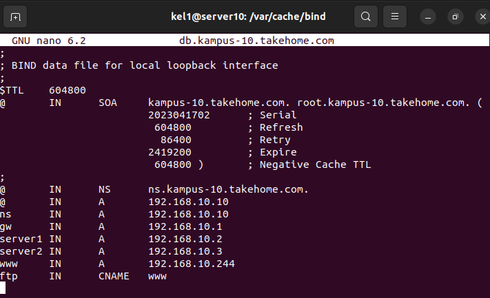

## Laporan Praktikum Tugas 9
## Aradhea Rangga Maulana | 2D4ITB | 3121600057

Langkah pertama adalah menyambungkan dns server yang telah dibuat dengan master. Dengan cara slave di server master kita dan allow transfer di dns server yang telah kita buat.
```sh
cd /etc/bind
sudo nano named.conf.local
```
Ubah isinya sesuai tampilan dibawah ini



Selanjutnya adalah membuka direktori /var/cache/bind menggunakan perintah

```sh
cd /var/cache/bind
```

Kemudian masuk ke db.kampus-10.takehome.com menggunakan perintah sudo nano

```sh
sudo nano db.kampus-10.takehome.com
```

Kemudian ubah sesuai alamat ip client / yang menjalankan web server



Menjalankan Project Laravel di client, menggunakan perintah
```sh
php artisan serve --host= {ip address client} --port=8000
```
Sehingga, web server bisa diakses oleh komputer jaringan lain menggunakan ip address client.

